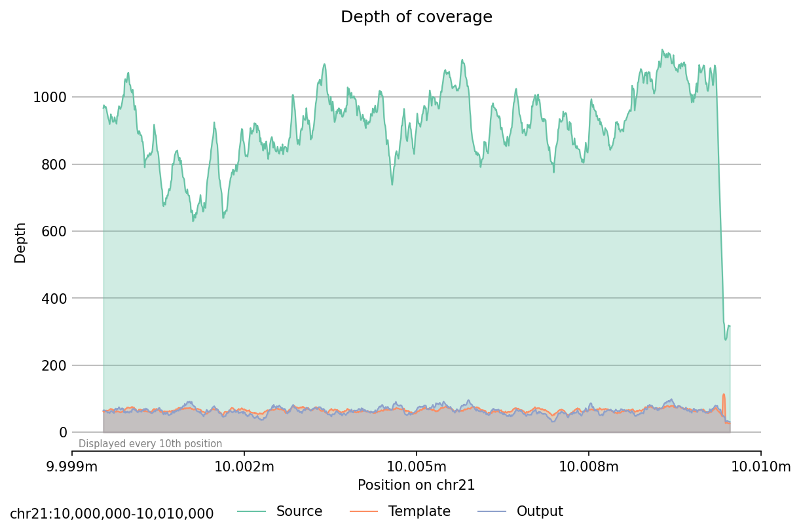

# samsampleX
A Python-based tool for dynamic BAM file downsampling, unlike existing tools that only downsample uniformly, based on a single global fraction value. Sample reads from a source BAM file to match the depth of coverage distribution of one or more template BAM file(s) through a created BED template.

## Features:
- Reproducable, integer seed-based deterministic downsampling
- Uniform sampling mode: retain a fixed fraction of reads, feature parity with existing tools.
- Map depth from multiple BAM files to a single BED template via common aggregation statistics (`min`, `mean`, `median`, `max`, `random`).
- Downsampling accuracy calculation (`stats`): per-window signed depth difference (raw and relative to template mean depth), TSV output, and a stderr summary of the top windows by absolute value for each of those two metrics (signed values shown; row count configurable with `--rows`, default 10).
- Plotting for visual sampling comparisons, with an option to emit a TSV file of the same data instead.

## Installation
### Requirements

- pysam
- xxHash
- numpy
- matplotlib
- scipy
- Snakemake (benchmarking only)
- pytest (testing only)

### Install samsampleX from PyPI
```{bash}
pip install samsampleX
```

## Usage
### Mapping
Extract depth of coverage from one or more template BAM file(s) to a single BED template. When multiple BAMs are provided, per-position depths are combined using the selected `--mode`.
```bash
# Single BAM
samsampleX map \
    --template-bam template.bam \
    --region chr1:1000-2000 \
    --out-bed template.bed

# Multiple BAMs (combined per-position using mean)
samsampleX map \
    --template-bam a.bam b.bam c.bam \
    --region chr1:1000-2000 \
    --mode mean \
    --out-bed template.bed
```
| Option | Description | Default |
|--------|-------------|---------|
| `--template-bam FILE [FILE ...]` | Input BAM file(s) (required) | - |
| `--region REGION` | Target region, samtools-style (required) | - |
| `--out-bed FILE` | Output BED file (required) | - |
| `--collapse INT` | Merge consecutive positions with depth diff <= INT | `0` |
| `--mode MODE` | Combine mode when multiple BAMs: `min`, `mean`, `median`, `max`, `random` | `mean` |
| `--seed INT` | Random seed for `--mode random` | `42` |

### Sampling
Downsample BAM based on provided BED template, using selected metric if multiple BEDs provided. Alternatively, use `--uniform` for position-independent uniform sampling similar to existing tools.

**Depth-based sampling (template required):**
```bash
samsampleX sample \
    --source-bam high_depth.bam \
    --template-bed template.bed \
    --region chr1:1000-2000 \
    --out-bam sampled.bam
```

**Uniform sampling (no template):**
```bash
samsampleX sample \
    --source-bam high_depth.bam \
    --uniform 0.5 \
    --region chr1:1000-2000 \
    --out-bam sampled.bam
```
Retains approximately 50% of reads uniformly across the region.

| Option | Description | Default |
|--------|-------------|---------|
| `--source-bam FILE` | Input BAM to sample reads from (required) | - |
| `--template-bed FILE` | Template BED file; required unless `--uniform` is used | - |
| `--uniform FRACTION` | Uniform sampling: retain fraction of reads. Bypasses template-based downsampling. | - |
| `--region REGION` | Target region, samtools-style (required) | - |
| `--out-bam FILE` | Output BAM file to write reads to (required) | - |
| `--mode MODE` | Combine mode for multiple templates: `min`, `mean`, `median`, `max`, `random` | `random` |
| `--stat STAT` | Statistic for summarising ratio over read span: `min`, `mean`, `median`, `max`, `random` | `mean` |
| `--seed INT` | Random seed for reproducibility | `42` |

### Plotting
Compare depth of coverage between source, template, and output BAM files. Output either as PNG plot or TSV data.

Green is source, orange is template and blue is output depth.

TSV contains one column for `position`, and three for respective depths of source, template and output.
```bash
# Generate PNG plot
samsampleX plot \
    --source-bam high_depth.bam \
    --template-bam template.bam \
    --out-bam sampled.bam \
    --region chr1:1000-2000 \
    --out-png coverage_plot.png
```

| Option | Description | Default |
|--------|-------------|---------|
| `--source-bam FILE` | Source BAM file (required) | - |
| `--template-bam FILE` | Template BAM file (mutually exclusive with --template-bed) | - |
| `--template-bed FILE` | Template BED file (mutually exclusive with --template-bam) | - |
| `--out-bam FILE` | Output BAM file from sampling (required) | - |
| `--region REGION` | Target region, samtools-style (required) | - |
| `--out-png FILE` | Output PNG plot (mutually exclusive with --out-tsv) | - |
| `--out-tsv FILE` | Output TSV data (mutually exclusive with --out-png) | - |

### Mapback
**If you do not use HLA\*LA and its specific read processing method, feel free to ignore this section.**

Remap HLA\*LA PRG-mapped reads back to canonical chr6 coordinates. This is a preprocessing step for BAM files produced by HLA\*LA, which maps reads to a pangenome reference graph (PRG) with synthetic contig names (`PRG_1`, `PRG_2`, ...). The mapback subcommand translates these back to chr6 positions using the HLA\*LA `sequences.txt` file and known HLA gene / alt contig boundaries.

The output BAM can then be used as input to `sample` for depth-aware downsampling on chr6.

```bash
# Step 1: remap PRG reads to chr6
samsampleX mapback \
    --source-bam hlala_output.bam \
    --region chr6:28000000-34000000 \
    --genome-build GRCh38 \
    --out-bam remapped.bam

# Step 2: sample from the remapped BAM
samsampleX sample \
    --source-bam remapped.bam \
    --template-bed template.bed \
    --region chr6:28000000-34000000 \
    --out-bam sampled.bam
```

| Option | Description | Default |
|--------|-------------|---------|
| `--source-bam FILE` | HLA\*LA-remapped BAM file (required) | - |
| `--region REGION` | Target region on chr6, samtools-style (required) | - |
| `--out-bam FILE` | Output BAM file (required) | - |
| `--genome-build BUILD` | Reference genome build: `GRCh38` or `GRCh37` (required) | - |
| `--prg-seq FILE` | Path to HLA\*LA `sequences.txt` | `HLA-LA/graphs/PRG_MHC_GRCh38_withIMGT/sequences.txt` |

### Stats
Compare depth between a template track and a result track over a region. Each input can be a BAM or BED file (inferred from file extension). Depths are aggregated into non-overlapping windows of `--window` base pairs.

TSV output is one row per window with a header line:

`chrom`, `start`, `end`, `mean_depth_temp`, `depth_diff`, `rel_depth_diff`, `mean_depth_res`

Per window, `depth_diff` is the mean signed depth difference (`result − template`). `rel_depth_diff` is `depth_diff` divided by `mean_depth_temp` when that mean is positive; otherwise it is not a finite value. `mean_depth_temp` and `mean_depth_res` are the mean depths of the template and result in the window.

Standard error prints the command line and, if any window has zero mean template or zero mean result depth, a warning. It then lists up to **`--rows`** windows (default **10**) with the largest **`|depth_diff|`**, and up to **`--rows`** with the largest **`|rel_depth_diff|`**, in each case printing the **signed** value (explicit `+` or `-`). Fewer lines appear when there are not enough windows or not enough finite relative values.
```bash
# BAM vs BAM
samsampleX stats \
    --template template.bam \
    --result sampled.bam \
    --region chr1:1000-2000

# BED vs BAM (e.g. cohort template against sampled output)
samsampleX stats \
    --template template.bed \
    --result sampled.bam \
    --region chr1:1000-2000 \
    --window 100 \
    --out-tsv per_window.tsv
```

| Option | Description | Default |
|--------|-------------|---------|
| `--template FILE` | Template track — BAM or BED (reference depths) (required) | - |
| `--result FILE` | Result track — BAM or BED (comparison depths) (required) | - |
| `--region REGION` | Target region, samtools-style (required) | - |
| `--window INT` | Window size in bp for non-overlapping aggregation | `100` |
| `--out-tsv FILE` | Per-window metrics TSV; use `-` for stdout | `-` |
| `--rows INT` | Top windows per metric to print on stderr (by `|depth_diff|` and `|rel_depth_diff|`) | `10` |

## Example



The following commands showcase an example workflow of a short, arbitrary region on chromosome 21. Three 1000 Genomes Project 30X WGS samples are downloaded and mapped to a template, then used to downsample a GIAB 300X WGS sample in the same region. The results are finally displayed on a plot.


```bash
cd examples/

# Download reference genome (GRCh38)
wget https://ftp.1000genomes.ebi.ac.uk/vol1/ftp/technical/reference/GRCh38_reference_genome/GRCh38_full_analysis_set_plus_decoy_hla.fa

# Download three first three 1K Genomes 30X WGS samples from
# https://ftp.1000genomes.ebi.ac.uk/vol1/ftp/data_collections/1000G_2504_high_coverage/1000G_2504_high_coverage.sequence.index
wget ftp://ftp.sra.ebi.ac.uk/vol1/run/ERR323/ERR3239480/NA12718.final.cram -O NA12718.cram && samtools index NA12718.cram
wget ftp://ftp.sra.ebi.ac.uk/vol1/run/ERR323/ERR3239481/NA12748.final.cram -O NA12748.cram && samtools index NA12748.cram
wget ftp://ftp.sra.ebi.ac.uk/vol1/run/ERR323/ERR3239482/NA12775.final.cram -O NA12775.cram && samtools index NA12775.cram

# Convert to BAM, restrict to target region and index
samtools view NA12718.cram chr21:10000000-10010000 -b -o NA12718.bam -T GRCh38_full_analysis_set_plus_decoy_hla.fa && samtools index NA12718.bam
samtools view NA12748.cram chr21:10000000-10010000 -b -o NA12748.bam -T GRCh38_full_analysis_set_plus_decoy_hla.fa && samtools index NA12748.bam
samtools view NA12775.cram chr21:10000000-10010000 -b -o NA12775.bam -T GRCh38_full_analysis_set_plus_decoy_hla.fa && samtools index NA12775.bam

# Run samsampleX workflow
samsampleX map \
    --template-bam NA12718.bam NA12748.bam NA12775.bam \
    --region chr21:10000000-10010000 \
    --mode mean \
    --collapse 0 \
    --out-bed template.bed
# template.bed should match example-template.bed

# Source BAM+index is provided in the examples directory, created by subsetting to target region from
# https://ftp.ncbi.nlm.nih.gov/ReferenceSamples/giab/data/AshkenazimTrio/HG002_NA24385_son/NIST_HiSeq_HG002_Homogeneity-10953946/NHGRI_Illumina300X_AJtrio_novoalign_bams/HG002.GRCh38.300x.bam
samsampleX sample \
    --source-bam HG002.GRCh38.300x.chr21:10000000-10010000.bam \
    --template-bed template.bed \
    --region chr21:10000000-10010000 \
    --seed 42 \
    --out-bam sampled.bam

samtools index sampled.bam

samsampleX plot \
    --source-bam HG002.GRCh38.300x.chr21:10000000-10010000.bam \
    --template-bed template.bed \
    --out-bam sampled.bam \
    --region chr21:10000000-10010000 \
    --out-png plot.png
# plot.png should match example-plot.png
```

## Testing

A `pytest` test suite is available. Run with the `-v` flag for a detailed report.
```bash
pytest -v
```

## Algorithm rundown

### Mapping
1. Parse target region from first BAM header
2. Compute per-position depth of coverage for each BAM over the region
3. If multiple BAMs: combine depths per-position using `--mode` (min, mean, median, max, random)
4. Optionally collapse consecutive similar depths (`--collapse`)
5. Write to BED4 format (`chrom`, `start`, `end`, `depth` columns)

### Sampling
1. **Uniform mode** (`--uniform FRACTION`): Skip template downsampling. For each read, hash the read name with xxHash32 to get $f_{read} \in [0, 1)$; keep if $f_{read} < FRACTION$. Deterministic and position-independent.
2. **Depth-based mode**: Load template depths from BED file(s); if multiple templates are provided, combine them per-position using the selected `--mode`
3. Compute source depths from BAM
4. Calculate per-position sampling coefficient: $ratio(i) = \min(1,\; depth_{template}(i) \;/\; depth_{source}(i))$
   - Positions where the template depth meets or exceeds the source depth get coefficient 1.0 (keep all reads)
   - Positions with zero source depth get coefficient 0.0
5. Build a cumulative sum of the coefficient array for O(1) range queries
6. For each read in the source BAM:
   - Hash read name with xxHash32 to produce a deterministic fraction $f_{read} \in [0, 1)$
   - Summarise the coefficient over the read's covered positions using `--stat` (min, mean, median, max, random; default mean via cumsum for mean). `random` picks one overlap ratio from a deterministic index (read span + seed).
   - Keep the read if $f_{read} < ratio_{read}$

## Metrics
Windowed statistics from `stats` (each value is a mean over positions inside that window, except `rel_depth_diff`, which scales that window’s mean signed error by the template mean depth):

| Metric | Significance |
| ------ | ------------ |
| `mean_depth_temp` | Mean depth for the template in the window |
| `depth_diff` | Mean signed depth difference (`result − template`) |
| `rel_depth_diff` | `depth_diff` / `mean_depth_temp` when `mean_depth_temp > 0` |
| `mean_depth_res` | Mean depth for the result in the window |


## Benchmarking
Benchmarking is done by a `snakemake` workflow in the `benchmarks` directory, and thus `snakemake` should be installed beforehand (for HPC systems, also install `snakemake-executor-plugin-slurm` or other plugin compatible with your system type). 

An `Apptainer` container definition `bench.def` that contains installs for `GATK`, `samtools`, `sambamba` and `samsampleX` is included. Build this container using `apptainer build bench.sif bench.def` before running the workflow.

Configure the benchmarking parameters in `config.yaml` in the same directory: copy and rename an existing chunk with all parameters and populate the values. All input files are expected to be found in the same directory as `config.yaml`, BAM files should be indexed using `samtools index`.

```{yaml}
# config.yaml
benchmarks:             # all chunks should be children of this header
  wgs-chr21:            # arbitrary name for benchmarking instance, parameters will be children
    chr: "chr21"        # specify contig
    start: 1            # region start coordinate
    end: 46709982       # region end coordinate
    seed: 42            # random seed (base)
    n_replicates: 1     # replicate count, will affect seed 
                        # (e.g. seed=42, n=3 will use seeds 43, 44, 45)
    collapse: 0         # define smoothing during mapping step
    templates:          # specify files to use as templates in sampling
      - "template.bam"  # all files must be in the benchmarks directory

    mode: "mean"        # how to determine per-position template depths from multiple template files
    source: "source.bam" # specify file to downsample

    coefficient: 0.1    # coefficient provided to GATK, samtools, sambamba

    cpu: 2              # specify hardware resource (used by all steps)
    mem_mb: 16384
    time: "10:00"
```

When executing the workflow, navigate to the `benchmarks` directory and make sure to use the following arguments:
```
snakemake -p --use-apptainer --apptainer-args '--bind $(pwd)'
```

A directory for all intermediate files will be created for each chunk defined in `config.yaml` and the final benchmark results will be made available in the `benchmarks` directory as `benchmark-{chunk_name}.tsv`.

## Development 

Get the most up-to-date version of samsampleX from Github and build locally.
```bash
git clone https://github.com/sdemiriz/samsampleX.git
cd samsampleX
pip install -e .
```
